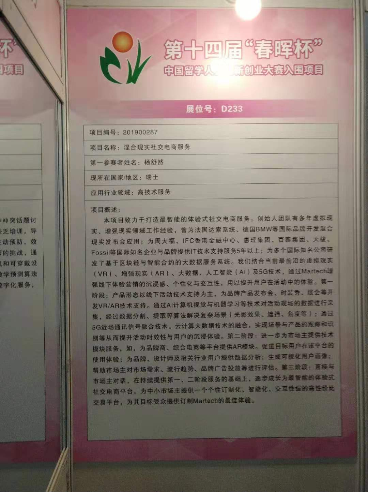

# 实践心得
### 在参观春晖杯的活动中，我收获了很多在学校体验不到的知识与境界，也见识到了创新创业竞争的激烈。 
### 在某市地区展台上，我看到了一家融资中的公司凭借政府订单“茁壮成长”，这既让地方政府收获了吸引高科技人才归国创业的政绩，也让公司在激烈的市场竞争中保有顽强的生命力，充分体现了双赢的效果。
### 在展位上可以看到各市对于交叉学科以及混合性学科人才的需求，特别是对高层次人才的需求量非常大。各地都有出台相当优惠的人才政策来吸引海外留学人才入驻，希望带动当地科技项目进行新一轮的行业洗牌。 
### 在春晖杯项目展区，我看到了很多值得学习的项目， 
像混合现实社交电商服务 ，其结合大数据，云计算，VR/AR以及人工智能提供体验式社交电商服务，为商家增强目标用户的沉浸感，还可以提供用户画像，进行定制化、智能化的交易服务。这其中涵盖了新工科、新商科、新文科的能力要求，难度极大。
### 这些项目中其实都指向同一个点：学科融合。跨学科研究、专业集群建设已经越来越普遍；我们作为网新人，需要着重自身学科知识与协作能力的结合。跨界、整合、集成、创新，是新时代下网新人需要掌握的能力。这其中，API作为一个典型的“黑盒子”为我们提供更广阔的前路，借助API模块，我们可以尽最大可能避开代码实现力较弱的缺点，降低了开发维护的门槛。在面向用户、市场方面，API以其标准化接口有更强的生命力。
